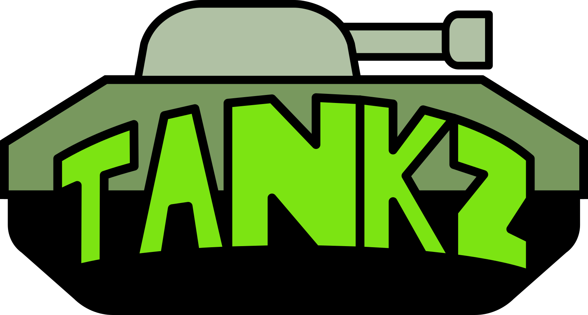

# Tankz - a game with tanks, but with a 'Z' at the end, because that's how cool games are named! What do you mean this title is too long? Of course not! Anyways...

Have you ever wanted a simplistic game from a few decades ago remade in one of the slowest languages on a framework that
isn't made for making games while drawing inspiration from modern-day game engines?

Well this is your lucky day!

Introducing **Tankz**, a Python-based Tkinter-powered sad excuse of a game engine trying to offer you tanks!

You can move, you can tilt your cannon, you can shoot and swap different kinds of ammo! (Note: This does not reflect the
current state of game.)

## TODO

- [antialiasing](https://stackoverflow.com/questions/14350645/is-there-an-antialiasing-method-for-python-pil)
- 